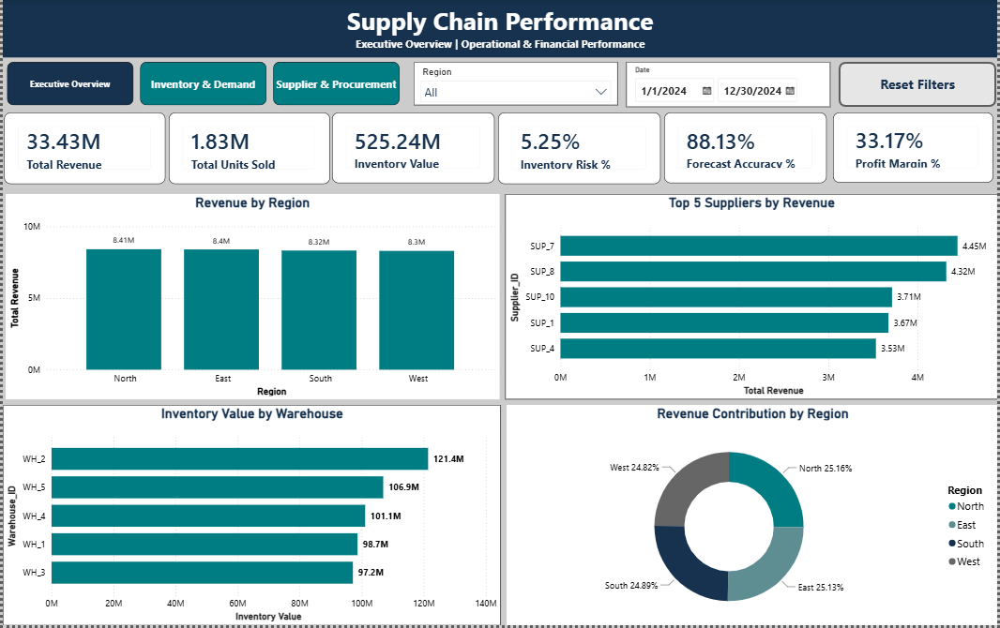
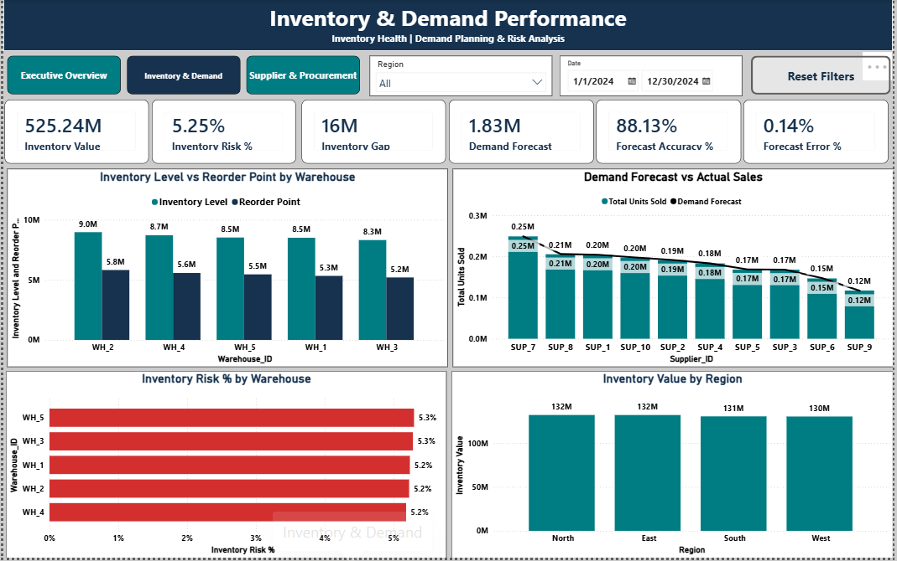
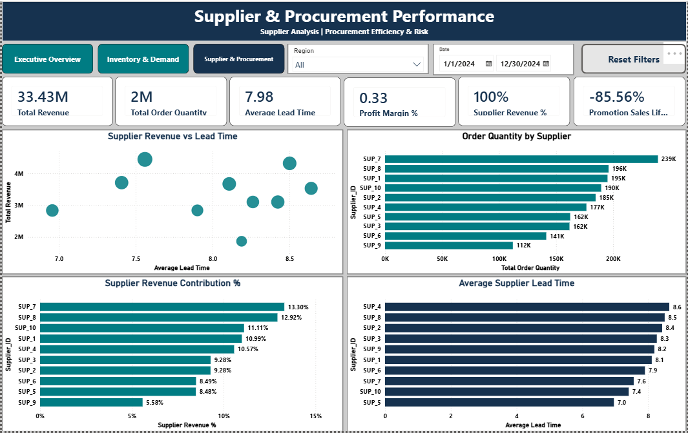

# Supply Chain Analytics Dashboard — Power BI

Interactive Supply Chain Performance, Inventory, Demand & Supplier Analytics

## 📊 Project Overview

This project presents a 3-page interactive Power BI dashboard designed to analyze supply chain financial performance, inventory health, demand forecasting, supplier performance, and procurement efficiency.

The dashboard transforms supply chain data into actionable management insights through a structured star-schema data model, DAX measures, interactive filtering, and executive-focused visualizations.

This project was developed as a personal analytics portfolio project to demonstrate practical capabilities in Power BI, Power Query, DAX, data modeling, supply chain analytics, and business intelligence.

## 🎯 Business Objective

The objective was to develop a centralized analytical solution that enables supply chain stakeholders to:

- Monitor financial and operational performance
- Evaluate inventory health and replenishment risk
- Compare demand forecasts with actual sales
- Analyze supplier performance and contribution
- Evaluate procurement efficiency and lead-time patterns
- Identify areas requiring further operational investigation
## 📊 Dataset

**Source:** Kaggle — [High-Dimensional Supply Chain Inventory Dataset](https://www.kaggle.com/datasets/ziya07/high-dimensional-supply-chain-inventory-dataset)

The dataset contains simulated daily, SKU-level supply chain data covering sales, inventory levels, supplier lead times, warehouses, regions, reorder points, promotions, costs, prices, and forecasted demand.

**License:** CC0 — Public Domain

The dataset was used as the foundation for the Power BI analysis and dashboard development in this project.

## 📊 Dashboard Preview

### Executive Overview

### Inventory & Demand

### Supplier & Procurement

## 📑 Dashboard Pages

### 1. Executive Overview

**Supply Chain Performance**

Focus areas:

- Revenue performance
- Sales volume
- Inventory value
- Inventory risk
- Forecast accuracy
- Profitability
- Regional and supplier performance

### 2. Inventory & Demand

**Inventory Health | Demand Planning & Risk Analysis**

Focus areas:

- Inventory value
- Inventory risk
- Inventory gap
- Inventory vs. reorder point
- Demand forecast vs. actual units sold
- Forecast accuracy and error
- Warehouse and regional inventory distribution

### 3. Supplier & Procurement

**Supplier Analysis | Procurement Efficiency & Risk**

Focus areas:

- Supplier revenue
- Order quantity
- Supplier revenue contribution
- Supplier lead time
- Supplier revenue vs. lead time
- Promotion sales lift

## 🧩 Data Model

The project uses a star-schema architecture consisting of:

### Fact Table

- `Fact_SupplyChain`

### Dimension Tables

- `Dim_Product`
- `Dim_Supplier`
- `Dim_Warehouse`
- `Dim_Date`
- `Dim_Region`

The dimension tables are connected to the central supply chain fact table through one-to-many relationships.

## ⚙️ Data Preparation

Data preparation was performed using Power Query, including:

- Data type validation
- Data quality checks
- Duplicate handling
- Relationship-key validation
- Data consistency checks
- Preparation of fact and dimension tables

## 📐 DAX & Analytics

Custom DAX measures were developed for:

- Total Revenue
- Total Cost
- Gross Profit
- Profit Margin %
- Total Units Sold
- Total Order Quantity
- Inventory Value
- Inventory Gap
- Inventory Risk %
- Demand Forecast
- Forecast Error %
- Forecast Accuracy %
- Average Lead Time
- Supplier Revenue %
- Supplier Revenue Contribution
- Promotion Sales Lift %

## 🔄 Interactivity

The dashboard includes:

- Region slicer
- Date slicer
- Cross-filtering between visuals
- Page navigation
- Page-specific reset-filter functionality
- Interactive KPI cards and analytical visuals

## 💡 Key Business Insights

- **Inventory Risk:** 5.25% inventory risk was identified despite zero recorded stockouts, highlighting the importance of monitoring inventory below reorder thresholds before stockouts occur.
- **Regional Inventory:** Inventory value is relatively balanced across the four regions, with approximately 130–132M held in each region.
- **Warehouse Inventory:** WH_2 has the highest inventory level and inventory value, making it an important location for inventory monitoring and optimization analysis.
- **Forecast Performance:** The dashboard reports 88.13% forecast accuracy, supporting continued monitoring of actual-versus-forecast deviations.
- **Regional Revenue:** Revenue is highly balanced across the four regions, with each contributing approximately one-quarter of total revenue.
- **Supplier Performance:** Combining supplier revenue, order quantity, and lead time provides a multidimensional view of supplier performance and procurement dependency.

## 🛠️ Tools & Technologies

- Power BI
- Power Query
- DAX
- Data Modeling
- Microsoft Excel
- Supply Chain Analytics
- Business Intelligence

## 📌 Project Outcome

The completed dashboard provides a unified view of supply chain financial, inventory, demand, and supplier performance, enabling users to move from high-level KPI monitoring to detailed operational analysis through interactive filtering.

## 👤 Author

**Khurshid Ahmed**

Data Analyst | Supply Chain & Telecom Analytics

Power BI | SQL | Tableau | SAP | Inventory Management
